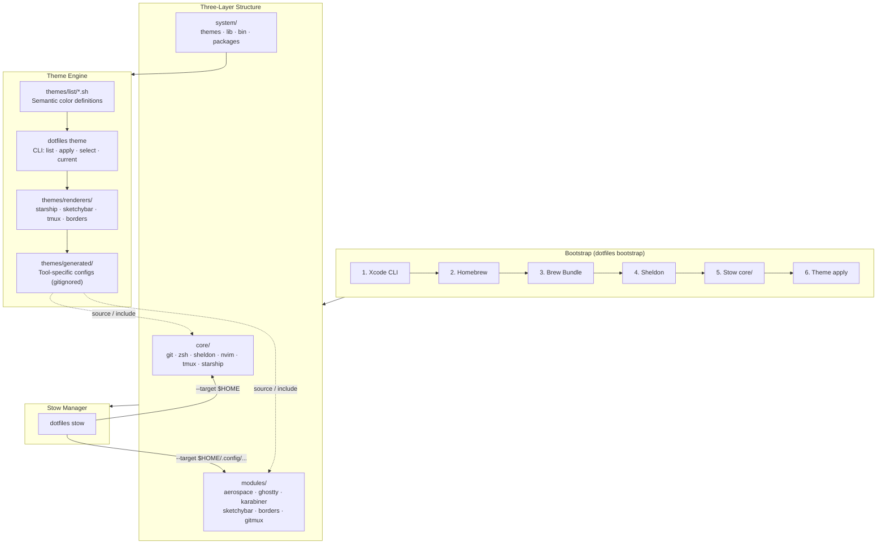
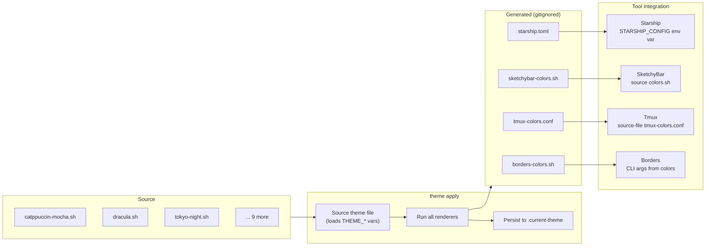
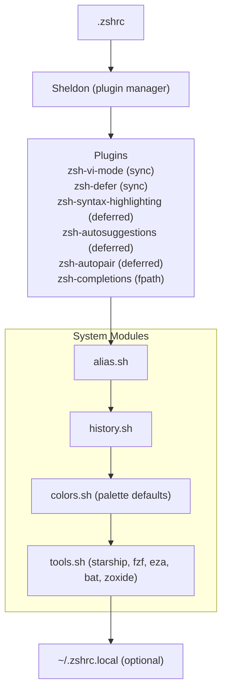
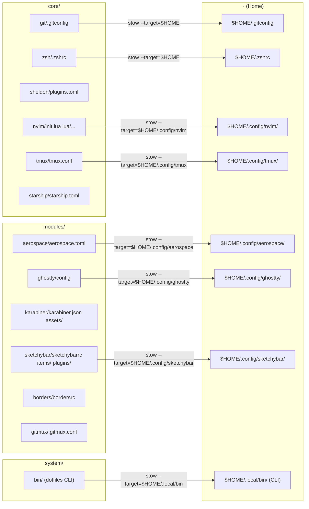

# dotfiles

A modular macOS development environment configuration system. Three-layer architecture, unified theme engine, one-command setup.

## Directory Structure

```
dotfiles/
├── core/              Cross-platform essentials
│   ├── git/             Git config
│   ├── zsh/             Shell config (Sheldon)
│   ├── sheldon/         Plugin manager config
│   ├── nvim/            Neovim config (lazy.nvim)
│   ├── tmux/            Tmux config
│   └── starship/        Prompt config
│
├── modules/           macOS platform modules
│   ├── aerospace/       Tiling window manager
│   ├── ghostty/         Terminal emulator
│   ├── karabiner/       Keyboard remapping
│   ├── sketchybar/      Menu bar replacement
│   ├── borders/         Window focus borders
│   └── gitmux/          Tmux git status
│
└── system/            Engine
    ├── bin/             CLI entry point (dotfiles, dotfiles-theme, ...)
    ├── themes/          Theme system (optional)
    ├── lib/             Shared libs & Zsh modules
    └── packages/        Brewfile dependency manifest
```

## Architecture



## Theme System Flow



## Zsh Startup Flow



## Stow Package Mapping



## Quick Start

### 1. Clone

```bash
git clone <repo-url> ~/dotfiles
```

### 2. Bootstrap

```bash
dotfiles bootstrap
```

Automatically: Xcode CLI → Homebrew → Brew Bundle → Sheldon lock → Stow core → Apply default theme.

### 3. macOS Modules (optional)

```bash
dotfiles modules install
```

### 4. macOS Defaults (optional)

```bash
dotfiles defaults
```

### 5. Verify & Restart

```bash
dotfiles doctor             # Check everything is working
exec zsh
```

## dotfiles CLI

All commands are available via `dotfiles help`:

```bash
dotfiles theme list                  # List available themes
dotfiles theme apply <name>          # Apply a theme
dotfiles theme select [name]         # Interactive selection (fzf) or by name
dotfiles theme current               # Show current theme
dotfiles stow apply --core           # Symlink core packages
dotfiles stow apply --modules        # Symlink macOS modules
dotfiles stow apply --all            # Symlink everything
dotfiles stow delete --core          # Remove core symlinks
dotfiles stow dry-run --core         # Preview stow operations
dotfiles doctor                      # Run health checks
dotfiles bootstrap                   # One-time setup
dotfiles modules install             # Install macOS modules
dotfiles defaults                    # Apply macOS system defaults
```

After running `dotfiles stow apply --core`, all commands are available at `~/.local/bin/dotfiles`.

## Theme CLI

```bash
dotfiles theme list              # List all themes
dotfiles theme current           # Show current theme
dotfiles theme apply catppuccin-mocha # Apply a theme
dotfiles theme select            # Interactive selection (fzf)
```

The theme system is optional — without running `dotfiles theme apply`, all tools use their default configs.

Each theme defines 29 semantic color variables (inspired by [Catppuccin](https://catppuccin.com) naming). Renderers convert these to tool-specific formats stored in `system/themes/generated/` (gitignored).

### Available Themes

catppuccin-mocha · catppuccin-macchiato · dracula · gruvbox-dark · tokyo-night · kanagawa · nord · rose-pine · everforest · solarized-dark · retro-phosphor

### Custom Theme

Create a `.sh` file in `system/themes/list/` exporting all `THEME_*` variables. See `system/themes/palette.sh` for the full variable list.

## Health Check

```bash
dotfiles doctor
```

Checks: dependencies, config files, theme status, known references.

## Local Overrides

- `~/.zshrc.local` — Local Zsh config (not tracked by Git)
- `~/.gitconfig.local` — Git user.name/email and other secrets

## Dependencies

Managed via Homebrew, declared in `system/packages/Brewfile`:

| Category | Tools |
|----------|-------|
| Core | git, stow, fzf |
| Shell | starship, sheldon, eza, bat, zoxide |
| Terminal | tmux, gitmux, nvim |
| Desktop | aerospace, ghostty, karabiner-elements, sketchybar, borders |
| Dev tools | shellcheck, shfmt |

## Platform Support

macOS only. Linux support is architecturally prepared:
- `system/lib/platform.sh` — Platform detection
- `system/lib/package.sh` — Package manager abstraction (Homebrew / apt / pacman)
- Future: add `modules/linux/` with i3/sway/waybar configs

## License

MIT
