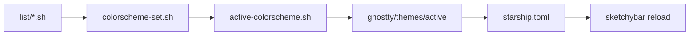

# dotfiles

这个仓库用于统一管理我的 macOS 开发环境配置，核心目标有 3 个：

- 用 GNU Stow 管理各模块的软链接。
- 用统一 colorscheme 驱动终端、提示符和状态栏的配色。
- 围绕 `AeroSpace`、`SketchyBar`、`Ghostty`、`zsh` 组织一套可维护的桌面工作流。

## 仓库概览

当前仓库可以分成两类内容：

- Stow package
  - `aerospace`
  - `ghostty`
  - `karabiner`
  - `nvim`
  - `sketchybar`
  - `starship`
  - `zsh`
- 支持目录
  - `support`: 主题源文件、状态文件、辅助脚本和安装脚本
  - `README.md`: 文档入口

重点说明：

- 只有真正镜像 `$HOME` 目录结构的目录，才应该被当作 Stow package 使用。
- `support/` 是统一的支持目录，不属于 Stow package。
- 当前主题链路会从 `support/colorscheme` 生成并刷新 `Ghostty`、`Starship`、`SketchyBar` 的部分配置。

## 模块说明

- `aerospace`: 平铺窗口管理器配置，负责 workspace、窗口布局、应用分配规则。
- `ghostty`: 终端配置、shader 和活动主题文件。
- `karabiner`: 键盘映射与复杂规则。
- `nvim`: Neovim 配置（`~/.config/nvim`，含 Lua 模块化入口与 lazy.nvim 锁文件；插件本体在 `~/.local/share/nvim`）。
- `sketchybar`: 菜单栏模块、插件、颜色和 helper。
- `starship`: Shell prompt 展示配置。
- `zsh`: shell 启动逻辑、常用 alias、工具初始化、colorscheme 应用入口。
- `support/colorscheme`: 配色方案源文件、当前激活配色、交互式切换入口。
- `support/scripts`: 独立工具脚本，例如 fzf / zoxide / git 辅助脚本。
- `support/zsh`: 供 `zsh` package 调用的辅助脚本与模块。

## 主题流转

当前 colorscheme 的工作链路如下：



`zsh/.zshrc` 会在 shell 启动时读取 `support/colorscheme/colorscheme-vars.sh` 得到当前主题名，并调用 `support/zsh/colorscheme-set.sh`。仅当所选主题与 `active` 不一致时才会重新生成 Ghostty/Starship 并 reload SketchyBar；用 selector 切换主题后会把选择写回 `colorscheme-vars.sh`，因此重开 Ghostty 或新开终端会保持同一主题。仓库路径可通过环境变量 `DOTFILES_DIR` 覆盖（默认 `~/dotfiles`）。

## 依赖清单

这个仓库默认运行在 macOS 上，建议至少具备以下依赖：

- `git`
- `stow`
- `zsh`
- `oh-my-zsh`
- `fzf`
- `starship`
- `eza`
- `bat`
- `zoxide`
- `sketchybar`
- `AeroSpace`
- `Ghostty`
- `Karabiner-Elements`
- `jq`
- `SwitchAudioSource`

其中有些工具是“核心依赖”，有些是“功能增强”：

- 核心依赖：`stow`、`zsh`、`oh-my-zsh`、`fzf`
- 桌面工作流：`AeroSpace`、`SketchyBar`、`Ghostty`、`Karabiner-Elements`
- 终端增强：`starship`、`eza`、`bat`、`zoxide`
- 插件依赖：`jq`、`SwitchAudioSource`

## 快速开始

**一键初始化**（推荐）：安装 Xcode CLI、Homebrew、`brew bundle` 依赖并执行 stow：

```bash
git clone <your-repo-url> "$HOME/dotfiles"
cd "$HOME/dotfiles"
./bootstrap.sh
```

手动分步：先安装依赖后，再 stow（见 [docs/setup.md](docs/setup.md)）：

```bash
cd "$HOME/dotfiles"
bash support/scripts/stow-packages.sh --dry-run
bash support/scripts/stow-packages.sh --apply
```

如果你只想先启用 shell 和终端部分：

```bash
cd "$HOME/dotfiles"
stow -nv zsh starship ghostty
stow zsh starship ghostty
```

## 文档导航

- 架构与目录边界：`docs/architecture.md`
- 安装与初始化（含 Bootstrap、Brewfile、工具链）：`docs/setup.md`
- Neovim 借鉴笔记（wsdjeg/nvim-config）：[`docs/nvim-inspiration-wsdjeg.md`](docs/nvim-inspiration-wsdjeg.md)
- colorscheme 系统说明：`support/colorscheme/README.md`

## 当前已知限制

- `support/` 现在承载了辅助脚本与状态文件，后续还会继续收敛生成产物与临时文件边界。
- 部分主题产物是由脚本生成后写回到仓库中的，容易造成 Git 变更噪音。
- `SketchyBar` 的 AeroSpace workspace 条已启用（focused/occupied/empty 状态、点击切换），多显示器下仅展示当前显示器上的 workspace。

## Stow 边界保护

仓库根目录现在包含 `.stow-local-ignore`，其目的是让误执行 `stow .` 时不要把整个仓库根目录当成一个 package 链接进 `$HOME`。

推荐做法仍然是二选一：

- 显式写出 package 名称执行 `stow`
- 使用 `support/scripts/stow-packages.sh`

后续优化会继续围绕这些边界问题展开。
