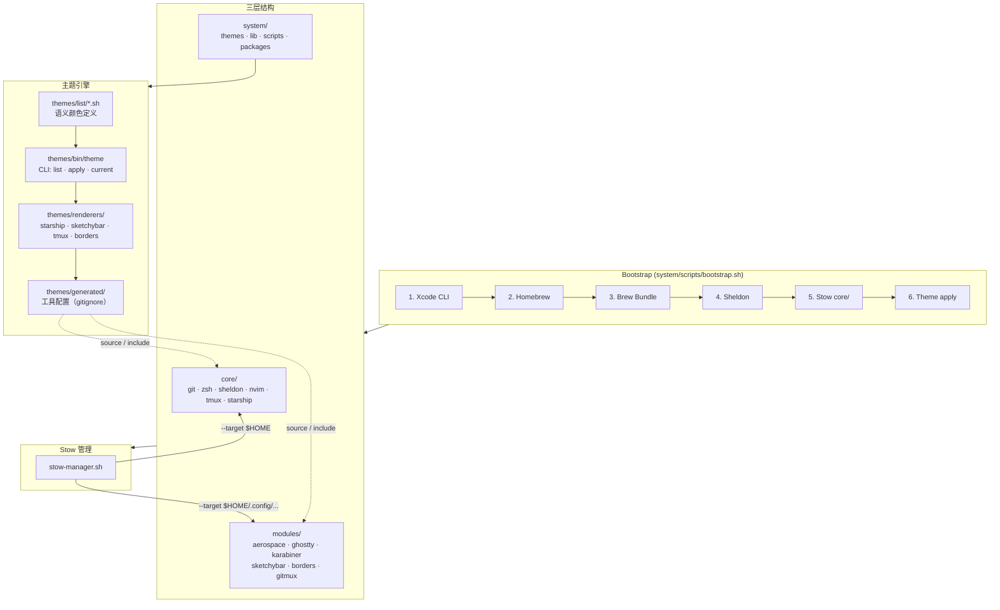
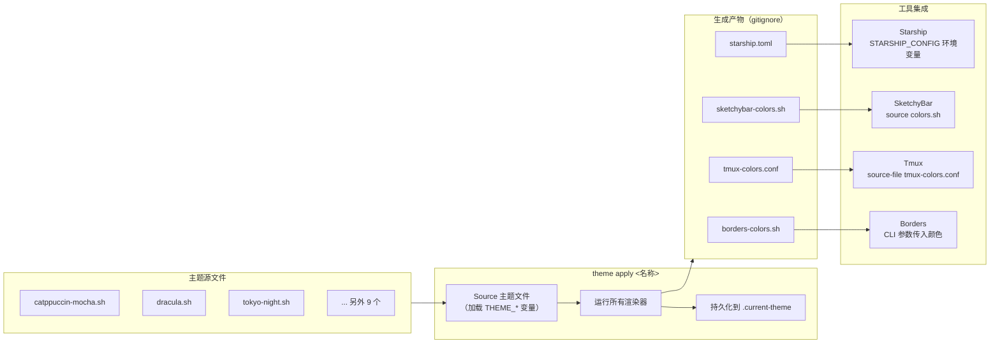
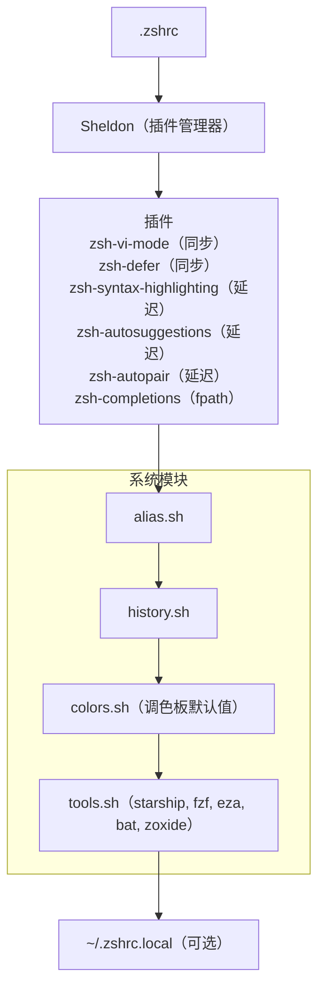
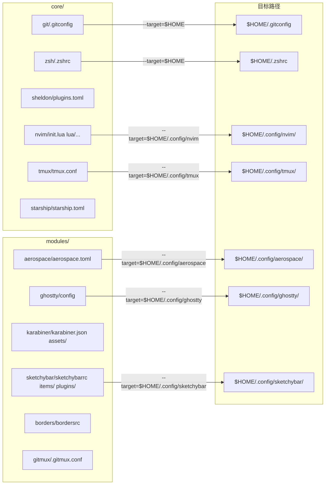

# dotfiles 使用指南

模块化的 macOS 开发环境配置系统。三层架构，统一主题引擎，一键安装。

[English](README.md)

## 目录结构

```
dotfiles/
├── core/              跨平台核心工具
│   ├── git/             Git 配置
│   ├── zsh/             Shell 配置（Sheldon）
│   ├── sheldon/         插件管理器配置
│   ├── nvim/            Neovim 配置（lazy.nvim）
│   ├── tmux/            Tmux 配置
│   └── starship/        提示符配置
│
├── modules/           macOS 平台模块
│   ├── aerospace/       窗口管理器
│   ├── ghostty/         终端模拟器
│   ├── karabiner/       键盘映射
│   ├── sketchybar/      状态栏
│   ├── borders/         窗口边框
│   └── gitmux/          Tmux Git 状态
│
└── system/            引擎
    ├── themes/          主题系统（可选）
    ├── lib/             共享库与 Zsh 模块
    ├── scripts/         安装与管理脚本
    └── packages/        Brewfile 依赖声明
```

## 架构总览



## 主题系统流程



## Zsh 启动流程



## Stow 包映射



## 系统要求

- macOS（Apple Silicon 或 Intel）
- Git
- 网络连接（首次安装需下载依赖）

## 安装流程

### 第一步：克隆仓库

```bash
git clone <repo-url> ~/dotfiles
```

如果克隆到非 `~/dotfiles` 路径，后续所有脚本都支持通过 `DOTFILES_DIR` 环境变量覆盖：

```bash
export DOTFILES=/your/custom/path
git clone <repo-url> "$DOTFILES"
DOTFILES_DIR="$DOTFILES" "$DOTFILES/system/scripts/bootstrap.sh"
```

### 第二步：一键安装

```bash
~/dotfiles/system/scripts/bootstrap.sh
```

脚本按顺序执行：

1. **Xcode CLI Tools** — 检测并安装（如缺失）
2. **Homebrew** — 检测并安装（如缺失）
3. **Brew Bundle** — 根据 `system/packages/Brewfile` 安装所有依赖
4. **Sheldon** — 锁定 Zsh 插件
5. **Stow 核心包** — 创建 git、zsh、nvim、tmux、starship 的 symlink
6. **默认主题** — 应用 darkppuccin 主题

脚本会在最后提示下一步操作。

### 第三步：安装 macOS 模块（可选）

核心包安装后，你的 Shell 和终端已经可以工作了。macOS 桌面工具是可选的：

```bash
~/dotfiles/system/scripts/install-modules.sh
```

这会安装以下模块的 symlink：
- **AeroSpace** — 平铺窗口管理器
- **Ghostty** — 终端模拟器
- **Karabiner-Elements** — 键盘映射
- **SketchyBar** — macOS 状态栏
- **Borders** — 窗口焦点边框
- **gitmux** — Tmux 中的 Git 状态显示

### 第四步：设置 macOS 系统偏好（可选）

```bash
~/dotfiles/system/scripts/macos-defaults.sh
```

配置项目包括：
- 键盘快速重复（KeyRepeat=2, InitialKeyRepeat=15）
- Finder 显示隐藏文件和路径栏
- Dock 自动隐藏、无延迟
- 截图保存到 Downloads，无阴影

### 第五步：重启 Shell

```bash
exec zsh
```

首次启动时 Sheldon 会自动加载所有已锁定的插件。

## 日常使用

### 主题切换

主题系统让你一键切换全局配色，所有工具同步生效。

```bash
theme list              # 列出所有可用主题
theme apply darkppuccin # 应用指定主题
theme apply             # 交互式选择（需要 fzf）
theme current           # 查看当前主题
```

切换主题后，Starship、SketchyBar、Tmux、Borders 会自动刷新。新开的终端也会使用同一主题。

### Shell 快捷键

| 快捷键 | 功能 |
|--------|------|
| `Ctrl+R` | 搜索命令历史（fzf） |
| `Ctrl+T` | 搜索文件（fzf + bat 预览） |
| `Alt+C` | 跳转目录（fzf + zoxide） |
| `::` | fzf 补全触发符 |
| `ESC` + `hjkl` | Vi 模式移动（zsh-vi-mode） |

### 常用别名

```bash
# Git
gs          git status -s
ga          git add .
gc "msg"    git commit -m "msg"
glog        git log --oneline --graph --all

# 文件操作
ls          eza（替代 ls）
ll          eza -lhg（详细列表）
cat         bat --paging=never（语法高亮）

# 目录跳转
z foo       zoxide 跳转到 foo 相关目录
cdd         返回上一个目录

# fzf 工具
fh          搜索命令历史
nvimf       fzf 搜索文件并用 nvim 打开
```

### Tmux

| 快捷键 | 功能 |
|--------|------|
| `Ctrl+Alt+Shift+b` | Tmux 前缀键 |
| `前缀 + p` | 打开/关闭浮动终端 |
| `前缀 + Ctrl+s` | 保存 session |
| `前缀 + Ctrl+r` | 恢复 session |

## 自定义

### 添加本地配置

系统不会覆盖你的本地配置文件：

- **`~/.zshrc.local`** — 放入你的本地 Zsh 配置（别名、PATH、环境变量等）
- **`~/.gitconfig.local`** — 放入你的 Git 用户名和邮箱

示例 `~/.gitconfig.local`：

```gitconfig
[user]
    name = Your Name
    email = you@example.com
```

示例 `~/.zshrc.local`：

```bash
export JAVA_HOME=$(/usr/libexec/java_home)
export PATH="$HOME/go/bin:$PATH"
```

### 创建自定义主题

在 `system/themes/list/` 下新建 `.sh` 文件：

```bash
#!/usr/bin/env bash
# Theme: my-theme
export THEME_CRUST="#11111b"
export THEME_MANTLE="#181825"
export THEME_BASE="#1e1e2e"
export THEME_SURFACE0="#313244"
export THEME_SURFACE1="#45475a"
export THEME_SURFACE2="#585b70"
export THEME_OVERLAY0="#6c7086"
export THEME_OVERLAY1="#7f849c"
export THEME_OVERLAY2="#9399b2"
export THEME_TEXT="#cdd6f4"
export THEME_SUBTEXT1="#bac2de"
export THEME_SUBTEXT0="#a6adc8"
export THEME_ROSEWATER="#f5e0dc"
export THEME_FLAMINGO="#f2cdcd"
export THEME_PINK="#f5c2e7"
export THEME_MAUVE="#cba6f7"
export THEME_RED="#f38ba8"
export THEME_MAROON="#eba0ac"
export THEME_PEACH="#fab387"
export THEME_YELLOW="#f9e2af"
export THEME_GREEN="#a6e3a1"
export THEME_TEAL="#94e2d5"
export THEME_SKY="#89dceb"
export THEME_SAPPHIRE="#74c7ec"
export THEME_BLUE="#89b4fa"
export THEME_LAVENDER="#b4befe"
export THEME_CURSOR="#f5e0dc"
```

然后运行 `theme apply my-theme`。

## 健康检查

```bash
~/dotfiles/system/scripts/doctor.sh
```

检查项目：依赖安装、配置文件存在性、主题状态、已知引用有效性。

### 管理 Stow 包

```bash
# 查看当前 symlink 状态
~/dotfiles/system/scripts/stow-manager.sh dry-run --core

# 重新链接（修改配置后）
~/dotfiles/system/scripts/stow-manager.sh apply --core

# 卸载所有核心包
~/dotfiles/system/scripts/stow-manager.sh delete --core

# 仅卸载模块
~/dotfiles/system/scripts/stow-manager.sh delete --modules
```

## 卸载

```bash
# 卸载所有 symlink
~/dotfiles/system/scripts/stow-manager.sh delete --all

# 删除仓库
rm -rf ~/dotfiles

# 删除 Sheldon 数据
rm -rf ~/.local/share/sheldon

# 删除本地覆盖文件（如果有）
rm -f ~/.zshrc.local ~/.gitconfig.local
```

## 故障排除

### Shell 启动报错

检查 Sheldon 是否已安装并锁定插件：

```bash
command -v sheldon && sheldon lock --update
```

### Stow 冲突

如果 stow 报告文件冲突，说明目标位置已有非 symlink 文件。手动处理后重试：

```bash
mv ~/.gitconfig ~/.gitconfig.bak
~/dotfiles/system/scripts/stow-manager.sh apply --core
```

### 主题不生效

```bash
theme current
# 如果显示 (none)
theme apply darkppuccin
```

## 依赖

核心依赖通过 Homebrew 管理，声明在 `system/packages/Brewfile` 中：

| 类别 | 工具 |
|------|------|
| 核心 | git, stow, fzf |
| Shell | starship, sheldon, eza, bat, zoxide |
| 终端 | tmux, gitmux, nvim |
| 桌面 | aerospace, ghostty, karabiner-elements, sketchybar, borders |
| 开发工具 | shellcheck, shfmt |
