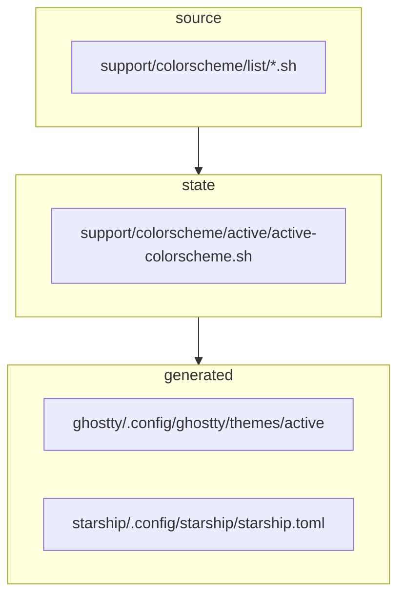
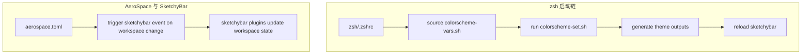

# Dotfiles Architecture

## 目标

这个仓库的目标不是单纯“存放配置文件”，而是把配置拆成可维护的几个层次：

- Stow package：真正映射到 `$HOME` 的配置目录
- Support files：为配置生成、切换、同步提供支持的脚本和数据
- Generated files：由脚本生成、供具体工具消费的派生配置

## 目录边界

### 1. Stow package

以下目录应被视为 Stow package：

- `aerospace`
- `ghostty`
- `karabiner`
- `sketchybar`
- `starship`
- `zsh`

这些目录内部的结构应尽量镜像最终的目标路径，例如：

- `aerospace/.config/aerospace/...`
- `ghostty/.config/ghostty/...`
- `zsh/.zshrc`

### 2. Support files

以下目录目前更适合视为支持目录，而不是直接 stow 的 package：

- `support/colorscheme`
- `support/scripts`
- `support/zsh`

它们承担的职责包括：

- 存放主题源文件
- 存放当前活动主题状态
- 提供交互式切换脚本
- 提供 shell 辅助工具脚本

仓库根目录额外放置了 `.stow-local-ignore`，专门用于拦截把仓库根目录当成单个 package 的误操作。
这意味着：

- `stow zsh`、`stow ghostty` 这类显式 package 操作仍然正常
- `stow .` 不再被视为推荐入口
- 一键安装建议改用显式 package 列表或 `support/scripts/stow-packages.sh`

## 主题系统架构

当前 colorscheme 系统大致分成 3 层：

执行入口主要有两个：

- `support/colorscheme/colorscheme-selector.sh`: 使用 `fzf` 选择主题
- `support/zsh/colorscheme-set.sh`: 应用主题并刷新目标配置

应用主题时会写回 `support/colorscheme/colorscheme-vars.sh`，使重开 Ghostty/新开终端后仍使用同一主题；仅当所选主题与 active 不一致时才重新生成 Ghostty/Starship 并 reload SketchyBar。路径可通过 `DOTFILES_DIR` 覆盖（默认 `~/dotfiles`）。

## 模块关系

## 当前维护风险

- 根目录现在收敛为 package、`docs/` 和 `support/` 三类内容，但生成产物与状态文件边界仍可继续优化
- 生成产物直接写入仓库中的配置文件，容易带来 Git 噪音
- 多个脚本硬编码了 `~/dotfiles`，降低可移植性
- shell 启动时触发主题应用，会带来额外副作用

## 维护原则

后续重构建议遵守下面几条原则：

- 只有真正镜像 `$HOME` 的目录进入 Stow package 层
- 支持脚本与生成产物分离
- 生成逻辑尽量只在“切换主题”时触发，而不是每次打开 shell 都触发
- 文档明确标注哪些目录可以 `stow`，哪些目录不能 `stow`
