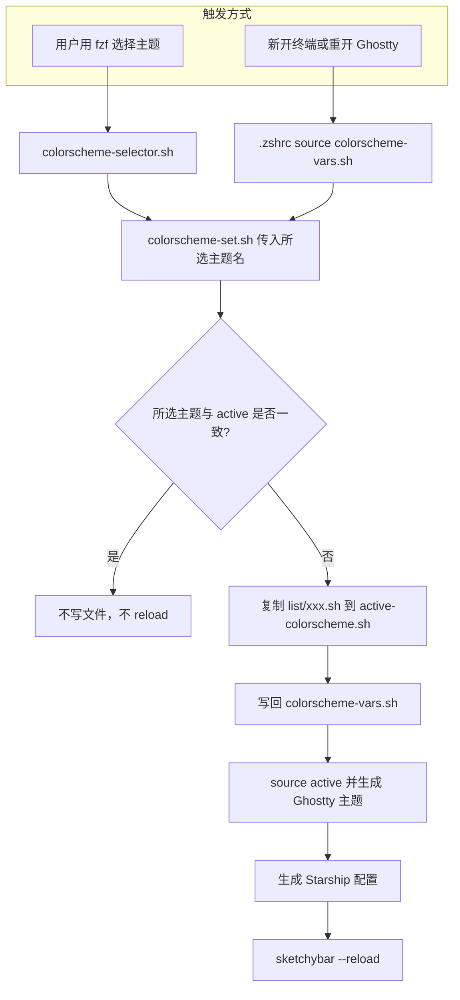

# 颜色方案管理系统（Colorscheme System）

这是整个项目的核心，实现了所有应用的颜色统一管理。

## 工作流程

## 文件结构
- `support/colorscheme/list/` - 所有可用的颜色方案文件（如 `batman.sh`, `catppuccin-mocha.sh` 等）
- `support/colorscheme/active/active-colorscheme.sh` - 当前激活的颜色方案
- `support/colorscheme/colorscheme-vars.sh` - 当前选中的主题名；用 selector 切换主题时会写回此文件，重开 Ghostty/终端后仍生效
- `support/colorscheme/colorscheme-selector.sh` - 交互式颜色方案选择器
- `support/zsh/colorscheme-set.sh` - 颜色方案应用脚本（仅在与 active 不一致时重新生成 Ghostty/Starship 并 reload SketchyBar）

仓库路径默认 `~/dotfiles`，可通过环境变量 `DOTFILES_DIR` 覆盖。
